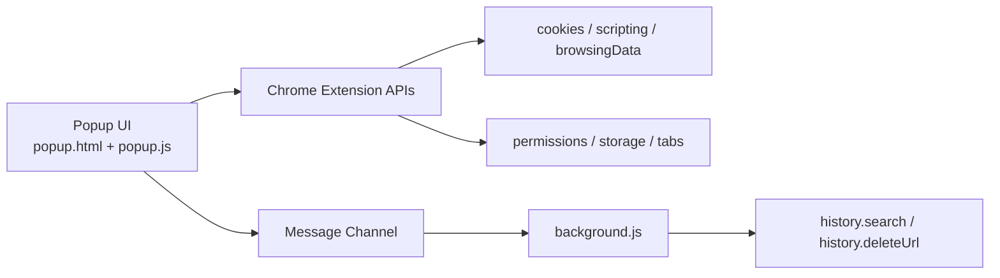

# 缓存清理专家 Pro

<p align="center">
  
</p>

<p align="center">
  面向当前站点的缓存与存储清理扩展，支持浏览记录清理、站点授权管理、站点保护列表、清理历史日志、深浅主题与 Tab 分栏操作。
</p>

<p align="center">
  
  
  
  
</p>

## 目录

- [项目亮点](#项目亮点)
- [功能清单](#功能清单)
- [近期更新](#近期更新)
- [界面与交互](#界面与交互)
- [界面截图](#界面截图)
- [架构说明](#架构说明)
- [快速开始](#快速开始)
- [权限说明](#权限说明)
- [兼容性与限制](#兼容性与限制)
- [项目结构](#项目结构)
- [开发建议](#开发建议)
- [常见问题](#常见问题)
- [版本](#版本)

## 项目亮点

- 专注“当前站点”清理，不是全浏览器粗暴清理。
- Cookie 权限按站点动态授权，可撤销，安全边界更清晰。
- 三个横向 Tab 分区：`清理`、`记录`、`权限`，减少长页面操作负担。
- 支持键盘左右切换 Tab（`ArrowLeft` / `ArrowRight`）。
- 主题可切换并持久化保存（深色 / 浅色）。
- 支持中文 / English 一键切换，并持久化语言选择。
- 支持站点保护列表，避免误清理关键站点。
- 支持清理历史日志查看（时间、站点、清理项、结果），并支持按结果筛选和清空日志。

## 功能清单

| 模块 | 能力 |
| --- | --- |
| 站点数据清理 | Cookie、LocalStorage、SessionStorage、IndexedDB、Cache Storage、Service Worker、浏览器缓存 |
| 浏览记录清理 | 按当前域名统计与清理，可选包含子域名，可选时间范围 |
| 授权管理 | 查看当前站点授权状态、授权当前站点、撤销当前站点授权 |
| 保护与审计 | 站点保护列表（白名单）管理，清理历史日志记录、结果筛选（全部/成功/失败/拦截）与清空 |
| 体验能力 | Tab 分栏、主题切换、语言切换、Toast 反馈、一键刷新统计 |

## 近期更新

- 新增中英文切换（`中文 / English`）并持久化语言设置。
- 弹窗窗口尺寸固定为 `400 x 540`，避免英文文本切换时窗口扩张与抖动。
- 优化 Tab 内容区底部留白过渡，避免按钮与边界贴边。
- 优化外层容器圆角（仅外层容器），保持内部卡片/按钮风格一致。
- 新增站点保护列表（白名单）：支持加入保护、取消保护、列表展示与命中拦截清理。
- 新增清理历史日志：记录时间、站点、清理项、结果、数量/详情。
- 新增日志筛选：`全部 / 成功 / 失败 / 拦截`。
- 新增一键清空日志；清空失败时增加本地存储兜底清空逻辑。
- 修复权限/白名单模块在浅色主题下按钮可读性问题。
- 修复深浅主题下局部“蒙版感”/上下色块不一致问题。
- 滚动条样式统一为灰色系，深浅主题保持一致。

## 界面与交互

| Tab | 说明 |
| --- | --- |
| 清理 | 查看各类存储统计，支持单项清理与一键清理 |
| 记录 | 按时间范围查看并清理当前域名浏览记录，并查看/筛选/清空最近清理历史日志 |
| 权限 | 查看当前站点权限状态，进行授权/撤销，管理保护站点，配置子域名与自动刷新 |

键盘交互：

- `ArrowLeft`：切换到左侧 Tab
- `ArrowRight`：切换到右侧 Tab

说明：

- 焦点在 `input`、`select`、`textarea` 或可编辑区域时，不拦截方向键。

## 界面截图

以下截图均使用 `images/` 目录中的本地图片文件。  
若图片未显示，请确认以下文件存在：`images/1.5.png`、`images/3.5.png`。

| 清理 Tab（浅色，上半） | 清理 Tab（浅色，下半） |
| --- | --- |
|  |  |
| 记录 Tab（浅色） | 权限与保护列表（浅色） |
|  |  |

补充（完整权限页示例）：


## 架构说明



说明：

- `popup.js` 负责 UI 状态、统计、清理动作和权限交互。
- `background.js` 负责历史记录相关的后台查询与清除。

## 快速开始

### 1) 安装（Edge / Chrome）

1. 打开扩展管理页：
   - Edge: `edge://extensions/`
   - Chrome: `chrome://extensions/`
2. 开启“开发者模式”。
3. 点击“加载已解压的扩展程序”，选择本项目根目录。
4. 修改代码后回到扩展页点击“刷新”。

### 2) 运行与测试

1. 打开任意 `http/https` 网站。
2. 点击扩展图标打开弹窗。
3. 在 `清理` Tab 执行扫描或清理。
4. 在 `记录` Tab 验证历史统计与清除。
5. 在 `权限` Tab 测试授权/撤销是否生效。

## 权限说明

| 权限 | 用途 |
| --- | --- |
| `cookies` | 读取与删除 Cookie |
| `activeTab` | 获取当前活动标签页上下文 |
| `browsingData` | 清除浏览器缓存 |
| `storage` | 持久化主题、语言和当前 Tab 状态 |
| `scripting` | 注入脚本读取/清理站点存储 |
| `history` | 查询与删除浏览记录 |
| `optional_host_permissions` | 按站点请求/撤销授权（当前为 `<all_urls>` 可选） |

Cookie 清理策略：

- 若当前站点未授权，会在清理 Cookie 时触发授权请求。
- 拒绝授权时，Cookie 不会被清理，其它可清理项不受影响。

## 兼容性与限制

- 兼容 Chromium 内核浏览器：Edge、Chrome（Manifest V3）。
- 对 `edge://`、`chrome://`、扩展页等受限页面无法执行注入与清理。
- 历史搜索有上限：`HISTORY_MAX_RESULTS = 5000`。
- 存储大小统计是估算值，主要用于趋势与对比。

## 项目结构

```text
cookie-cleaner-extension/
├─ manifest.json
├─ popup.html
├─ popup.js
├─ background.js
├─ icon.png
├─ images/
│  ├─ 01.png
│  ├─ 1.5.png
│  ├─ 02.png
│  ├─ 03.png
│  └─ 3.5.png
└─ icons/
   ├─ icon16.png
   ├─ icon32.png
   └─ icon128.png
```

## 开发建议

- 提交前检查 `popup.js` 语法：`node --check popup.js`
- 改动 `manifest.json` 后务必在浏览器扩展页点击刷新
- 建议保留图标尺寸 `16 / 32 / 128` 与 manifest 一致

## 常见问题

**Q: 为什么有时 Cookie 数量显示为 `-` 或无法清理？**  
A: 当前站点可能尚未授权。请到 `权限` Tab 点击“授权”。

**Q: 为什么在 `edge://extensions/` 页面不能清理？**  
A: 浏览器限制，受保护页面不支持脚本注入和常规站点清理。

**Q: 浏览记录为什么显示为 0？**  
A: 可能是时间范围、域名匹配或子域名开关导致。请切换时间范围并确认“包含所有子域名数据”设置。

## 版本

- 当前版本：`2.0`
